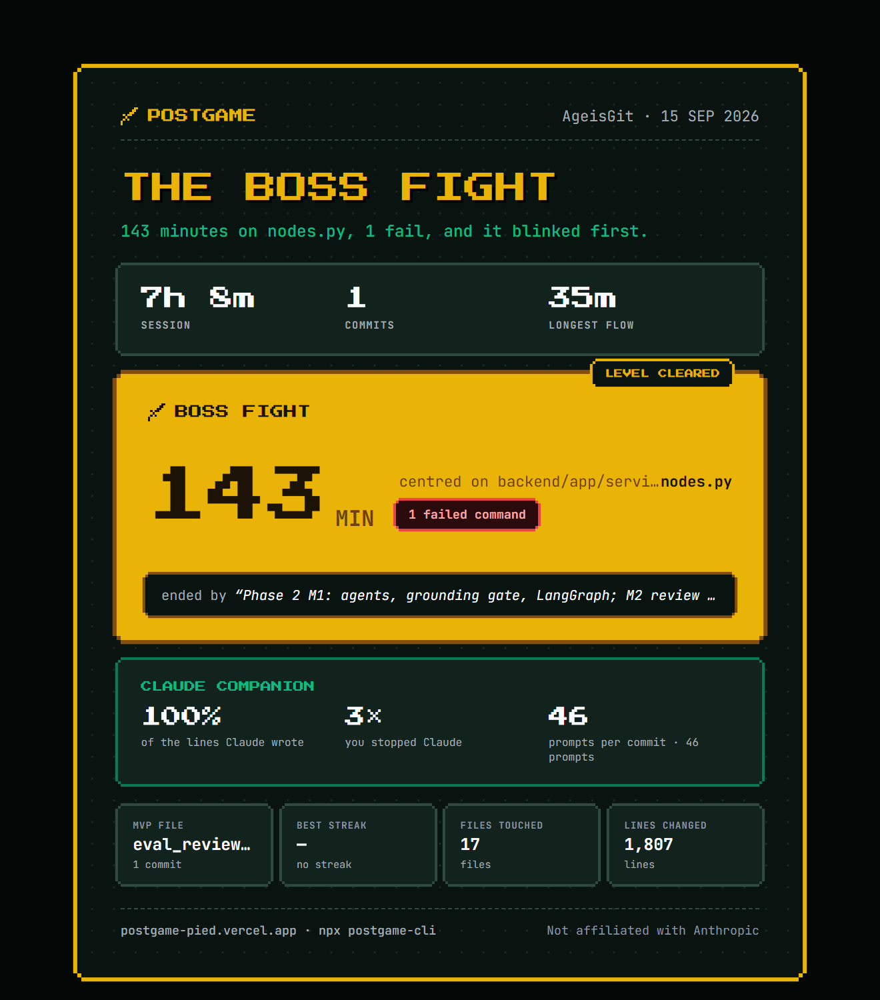

# postgame

**Spotify Wrapped for a single coding session.** Built from your git history and your Claude Code logs, and nothing leaves your machine but numbers and names.

<p align="center">
  
</p>

<p align="center">
  <a href="https://postgame-pied.vercel.app/r/xa8mww"><b>▶ See a sample recap</b></a>
</p>

```
npx postgame-cli
```

## What it is

You code for a few hours with Claude Code. Then you run one command in your project folder and get a link to a card that tells the story of that session:

- **The boss fight**: the hardest stretch between two commits, the file it was centred on, and the commit that ended it
- **Flow state**: your longest unbroken run
- **Claude companion**: how much of the committed code Claude wrote, and how many times you stopped it
- **MVP file, best streak, files touched, lines changed**
- **An archetype title**: *The Boss Fight*, *Autopilot*, *Backseat Driver*, *Deep Work*, *Vibe Coded* … picked by plain rules, not AI

It's a highlight reel, not a report card. No scores, no productivity grading.

## Usage

| Command | What it does |
|---|---|
| `npx postgame-cli` | Recap your most recent session and print a link |
| `npx postgame-cli --last 24` | Recap a fixed window, e.g. a whole hackathon |
| `npx postgame-cli --from 2026-09-15T10:00 --to 2026-09-15T18:00` | Recap a past window |
| `npx postgame-cli --dry-run` | Show exactly what would be uploaded, and upload nothing |
| `npx postgame-cli --name "My Project"` | Show a different project name on the card (default: the folder name) |
| `npx postgame-cli --list` | List your recent sessions, each with the command that recaps it |
| `npx postgame-cli --history` | List the cards you already made on this machine, with their links |

No Claude Code logs for your repo? It still works, with a git-only card.

## Privacy

Everything is computed locally from `git log` and `~/.claude/projects`. Only derived numbers, the repo name, file paths and one commit message are uploaded. No source code, no prompt text, no file contents. `--dry-run` prints the exact payload.