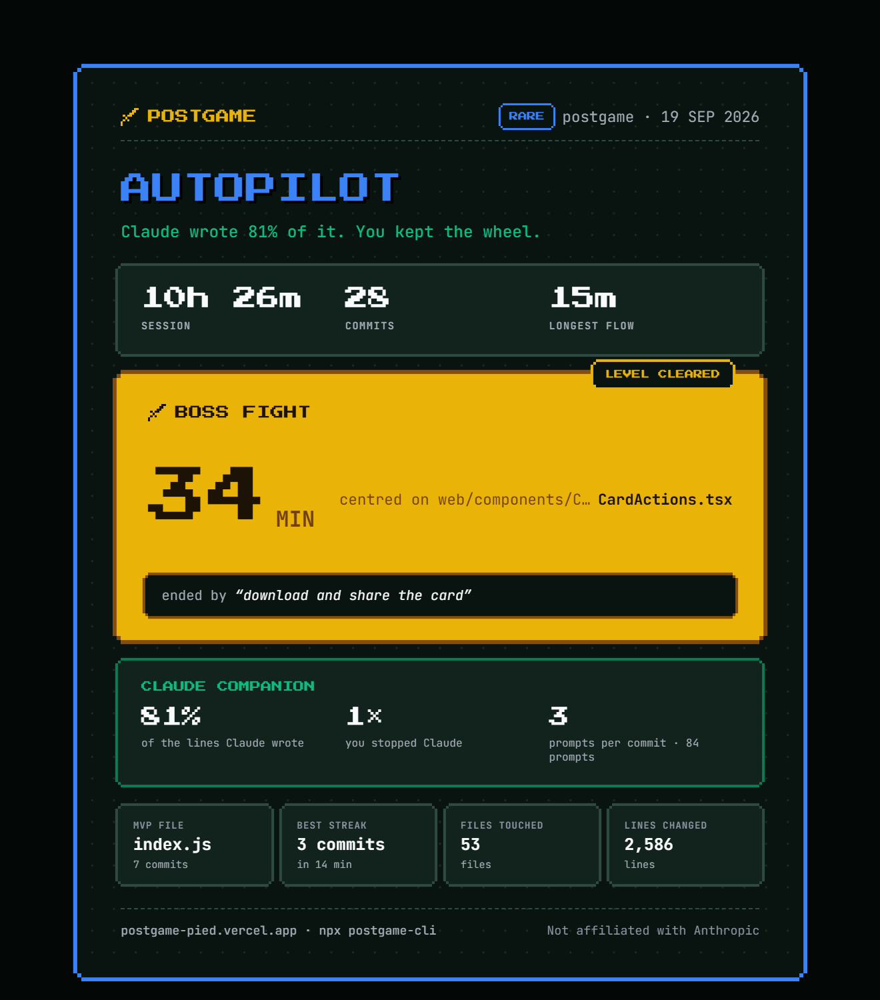

# postgame

**Spotify Wrapped for a single coding session.** Built from your git history and your Claude Code logs, and nothing leaves your machine but numbers and names.

<p align="center">
  
</p>

<p align="center">
  <i>postgame recapping its own build: 10h 26m, 28 commits, a 34-minute boss fight on the PNG export.<br>
  Made with <code>npx postgame-cli --from 2026-09-19T10:00 --to 2026-09-20T10:00</code> —
  <a href="https://postgame-pied.vercel.app/r/nnvdeh">open the live card</a>.</i>
</p>

<p align="center">
  <a href="https://postgame-pied.vercel.app/r/xa8mww"><b>See a sample recap</b></a> ·
  <a href="https://postgame-pied.vercel.app"><b>Live site</b></a> ·
  <a href="https://www.npmjs.com/package/postgame-cli"><b>npm</b></a>
</p>

### Demo

https://github.com/user-attachments/assets/069150eb-db8b-4807-9b46-dac434d2bced

```
npx postgame-cli
```

## What it is

You code for a few hours with Claude Code. Then you run one command in your project folder and get a link to a card that tells the story of that session:

- **The boss fight**: the hardest stretch between two commits, the file it was centred on, and the commit that ended it
- **Flow state**: your longest unbroken run
- **Claude companion**: how much of the committed code Claude wrote, and how many times you stopped it
- **MVP file, best streak, files touched, lines changed**
- **An archetype title**: *The Boss Fight*, *Autopilot*, *Backseat Driver*, *Deep Work*, *Vibe Coded* … picked by plain rules, not AI

It's a highlight reel, not a report card. No scores, no productivity grading.

## Usage

| Command | What it does |
|---|---|
| `npx postgame-cli` | Recap your most recent session and print a link |
| `npx postgame-cli --last 24` | Recap a fixed window, e.g. a whole hackathon |
| `npx postgame-cli --from 2026-09-15T10:00 --to 2026-09-15T18:00` | Recap a past window |
| `npx postgame-cli --dry-run` | Show exactly what would be uploaded, and upload nothing |
| `npx postgame-cli --name "My Project"` | Show a different project name on the card (default: the folder name) |
| `npx postgame-cli --list` | List your recent sessions, each with the command that recaps it |
| `npx postgame-cli --history` | List the cards you already made on this machine, with their links |

No Claude Code logs for your repo? It still works, with a git-only card.

## Privacy

Everything is computed locally from `git log` and `~/.claude/projects`. Only derived numbers, the repo name, file paths and one commit message are uploaded. No source code, no prompt text, no file contents. `--dry-run` prints the exact payload.

---

## Innovation & Originality

All development tools keep records of output—such as lines of code, the number of commits, and streaks. Yet none of them describe what a session was like — the part when you were stuck, until the moment it finally worked.

The games dealt with this many years ago, and after the match a screen shows you the story of the match.
It is not about how many lines of code you write. No one has used this idea in programming.

And a session isn't lines typed any more — it's prompts, test runs, and the moment
you took control of the wheel; those signals are stored in the local Claude Code logs and no one picks them up.
Prompts-per-commit and interrupt counts are new statistics, according to me.

## Problem-Solving Approach

The straightforward solution was a VS Code extension that monitored keystrokes, and I turned it down on two counts:
keystrokes stopped describing a session once AI wrote most of the code, and a judge
can't assess an extension unless they spend an hour coding first.

Therefore I reversed the approach—instead of observing, we should reconstruct. Both Git and Claude Code already write
records with timestamps to disk; afterwards you can read them and nothing else needs to be run.
Nothing runs in the background, and nothing ever leaves the machine.

All that remains is a single, sorted timeline, split into sessions wherever a gap lasts more than 30 minutes.
Flow consists of events that occur less than three minutes apart, and the boss fight is the highest-scoring gap between
commits — minutes, plus failed commands, prompts and repeated edits to the same file. Simple arithmetic, without the use of machine learning.

## Technical Implementation

Node CLI and Next.js on Vercel in one repo.

The CLI does all computation locally: parses `git log --numstat` and Claude Code's
JSONL session logs, normalises both into one event shape, and derives every stat
from the combined timeline; only the final figures are uploaded—never the code,
never prompts.

The server is intentionally simple: it takes JSON as input and produces a short ID, the card being rendered on the server. No
accounts and no login — just a key-value store holding one JSON per card.

## Functionality & Execution

A single command in any repository generates a live, shareable link.

- Session detection from merged git + Claude Code log timelines
- Boss fight, longest flow state, streaks, file churn, MVP file
- Prompt counts, prompts-per-commit, interrupts, Claude-authored line share
- 9 archetypes chosen by ordered rules, subtitles generated from real numbers
- Server-rendered card and link-unfurl preview image

Degradation is handled, not hoped for: no Claude Code logs, no commits in range, or no boss
fight — each one drops its own block and still leaves a deliberate card.

## User Experience

One command. One link. No signup. No setup. No dashboard.

It was based on two rules: the card should be a highlight reel not a report — that is, a headline followed by
large statistics, one notable mention of a boss fight, not a long list of metrics, and no scores or
efficiency ratings, not anything a manager could use to judge a person. Subtitles make a joke
about the session, not about the developer.

The links appear as images in the chat, which is why they can be shared.

## Real-World Impact

It's an enjoyable tool, not a painkiller.
The worth of it lies in recognition—when your own afternoon is described back to you accurately enough for you to laugh.

It does more by making AI-assisted work understandable. Most developers have no idea
how much of the session the model was in charge of, or how frequently it was overridden. Those figures
are invisible today.

## Scalability & Future Potential

It already scales: computation happens on each user's machine, so the server stores
a few kilobytes per card, with a cost per user that is almost nothing.

The timeline model is source-agnostic — adding Codex CLI, Gemini CLI or CI logs means one
adapter emits the same event shape and all the stats remain unaltered. New archetypes
are a row in a list of rules.

Next: weekly recaps, a GitHub Action that posts a card on a pull request, and hackathon
organisers reading recaps as build timelines.

---
